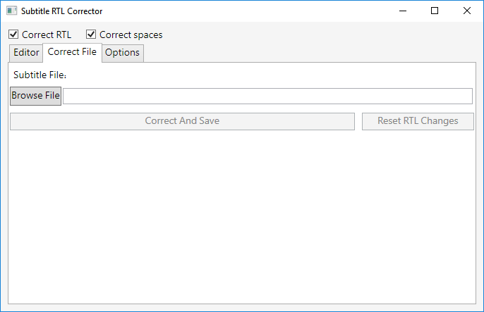
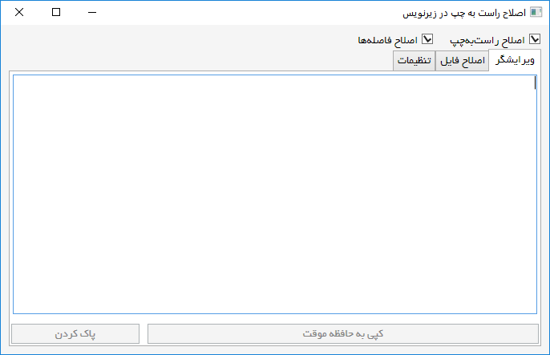

# SubtitleRtlCorrector
SubtitleRtlCorrector corrects display problem for Right-To-Left subtitle files. Edit

## Key features:
* Automatically adds RTL Embeding character before every special character.
* Automatically corrects spaces of all character.
* One click correcting .ass (Advanced Substation Alpha) files.
* Text editor for correcting texts and copying it to clipboard.
* Specialy designed for display RTL text correctly in [Aegisub](http://www.aegisub.org/) subtitle editor.
* Multi language (Persian and English).

You can download it [from here](https://github.com/Majid110/SubtitleRtlCorrector/releases)

## Screenshots:

